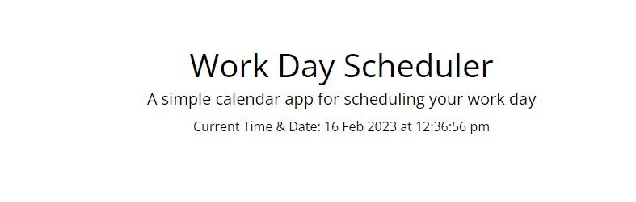
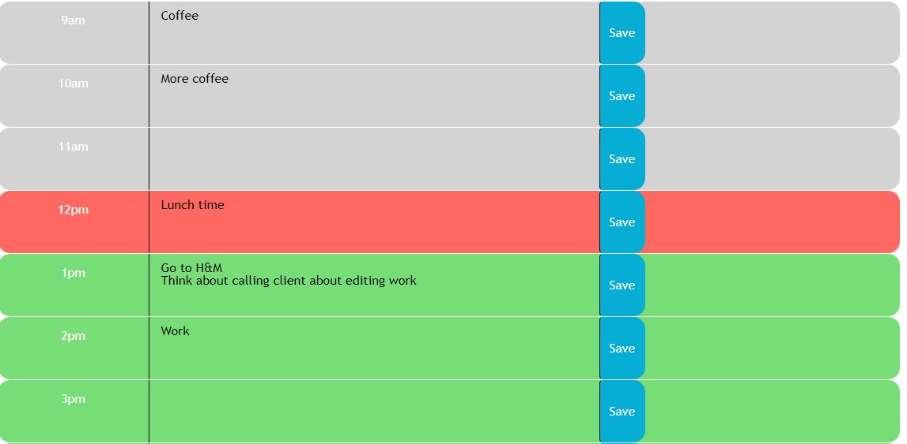

# DayPlanner

This is a simple calendar application that allows the user to save events for each hour.
The DayPlanner runs in the browser and features dynamically updated HTML and CSS powered by jQuery.

I have used the [Moment.js](https://momentjs.com/) library when working with date and time. 

## User Story

```md
AS AN employee with a busy schedule
I WANT to add important events to a daily planner
SO THAT I can manage my time effectively
```

## How it works

The app currently does the following:

* It displays the current day at the top of the calender when a user opens the planner.
 
* It presents timeblocks for standard business hours (9am to 5pm) when the user scrolls down.
 
* Each timeblock is color-coded based on past, present, and future when the timeblock is viewed.
 
* The user can enter an event when they click a timeblock

* The event is saved in local storage when the save button is clicked in that timeblock.

* Events persist when the page is refreshed

The following screenshot shows the current time as displayed on the page:




## Use the site
You can use the app by clicking on the following link.


